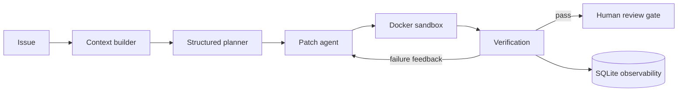

# Autonomous Coding Agent

A safety-first coding agent that turns an issue into a proposed code patch, verifies it in an ephemeral Docker sandbox, retries from test feedback, and records an auditable run. It never auto-merges: unverified or low-confidence fixes are escalated for human review.



## Highlights

- Uses Groq's `qwen/qwen3.8-27b` for structured planning and patch generation.
- Runs tests in Docker with network disabled, CPU/memory/PID limits, a read-only root filesystem, and timeouts.
- Validates and normalizes model-generated unified diffs before applying them to a disposable repository copy.
- Adds bounded self-correction, repeated-failure detection, confidence scoring, and an explicit human-review gate.
- Controls Groq usage with RPM/TPM pacing, bounded output sizes, and 429 retry-after backoff.
- Uses parsed Qwen reasoning so native `<think>` content never contaminates JSON plans or patch diffs.

## Quick start

Prerequisites: Python 3.11+, [uv](https://docs.astral.sh/uv/), Docker Desktop, and a Groq API key.

```powershell
uv sync --extra dev
Copy-Item .env.example .env
# Add GROQ_API_KEY to .env
docker build -t code-agent-sandbox:latest -f docker/sandbox.Dockerfile .
uv run python -m coding_agent.cli run --repo . --issue "Add a helper that normalizes email addresses" --test "pytest -q"
```

The default configuration is intentionally conservative for a 15 RPM / 8k TPM Groq quota: 12 RPM pacing, a 70% TPM safety margin, 3.5k-character repository context, and bounded plan/patch outputs.

The command writes `agent-run.json` and persists events to `.agent/runs.sqlite3`. It does not alter the target repository. After reviewing a successful report, apply that exact verified patch without a new model call:

```powershell
uv run python -m coding_agent.cli apply-report --repo . --report agent-run.json
```

## Evaluation harness

The project includes a 15-task synthetic software-engineering benchmark and a dedicated demo target repository. Each benchmark item has a scoped test command, so unrelated intentional failures in the fixture repository do not invalidate another task.

```powershell
uv run python -m coding_agent.cli eval `
  --repo ..\demo-target-repo `
  --benchmark benchmarks\demo-target-benchmark.json `
  --test "PYTHONPATH=src pytest -q" `
  --attempts 3
```

### Evaluation improvement

- Initial benchmark result: **60% review-ready resolution (9/15 tasks)**.
- Root cause: otherwise-correct model patches were rejected before testing because of malformed/fenced diffs, ambiguous Git path prefixes, hunk counts, and Windows CRLF/LF context mismatches.
- Improvements: added diff normalization, Markdown-fence removal, hunk-count repair, Git path handling, CRLF/LF-tolerant application, and stricter generation instructions.
- Final result: **100% verified resolution (15/15 tasks)** on the synthetic benchmark after these patch-pipeline fixes.

## Safety properties

- Patches cannot escape the target repository or modify `.git` internals.
- Commands execute only in a disposable, network-isolated container.
- Retries are capped; repeated failures escalate instead of looping indefinitely.
- Generated reports and local API keys are excluded from Git.
