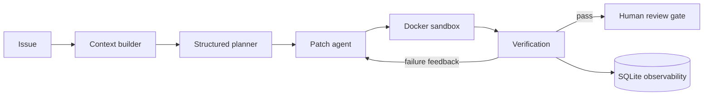

# Autonomous Coding Agent

A safety-first coding agent that turns an issue into a proposed patch, verifies it in an ephemeral Docker sandbox, retries from test feedback, and records an auditable run. It **never auto-merges**: low-confidence and failed runs are escalated for human review.



## Quick start

Prerequisites: Python 3.11+, Docker Desktop running, and an Google AI Studio API key.

```bash
python -m venv .venv
.venv\\Scripts\\activate
pip install -e ".[dev]"
copy .env.example .env
# add GEMINI_API_KEY to .env
docker build -t code-agent-sandbox:latest -f docker/sandbox.Dockerfile .
code-agent run --repo . --issue "Add a helper that normalizes email addresses" --test "pytest -q"
```

The included sandbox image has pytest and Git. For a different target repo, set `SANDBOX_IMAGE` to an image containing its test toolchain.

The command writes `agent-run.json` and persists run events to `.agent/runs.sqlite3`. It does not modify the target repository by default. After reviewing a successful `agent-run.json`, apply that exact verified patch without a new model call:

```bash
code-agent apply-report --repo . --report agent-run.json
```

## Evaluation harness

```bash
code-agent eval --repo path/to/repo --benchmark benchmarks/example.json --test "pytest -q"
```

This reports resolution rate, average retries, and mean latency. Run it before citing any metric on a resume.

## Safety properties

- Docker commands use network isolation, CPU/memory/PID limits, a read-only base filesystem, and a timeout.
- Unified diffs are validated to prohibit path traversal and `.git` changes.
- Retries are capped, and repeated test failures trigger escalation.
- No PR creation or merge action is performed; human review is a terminal gate.


